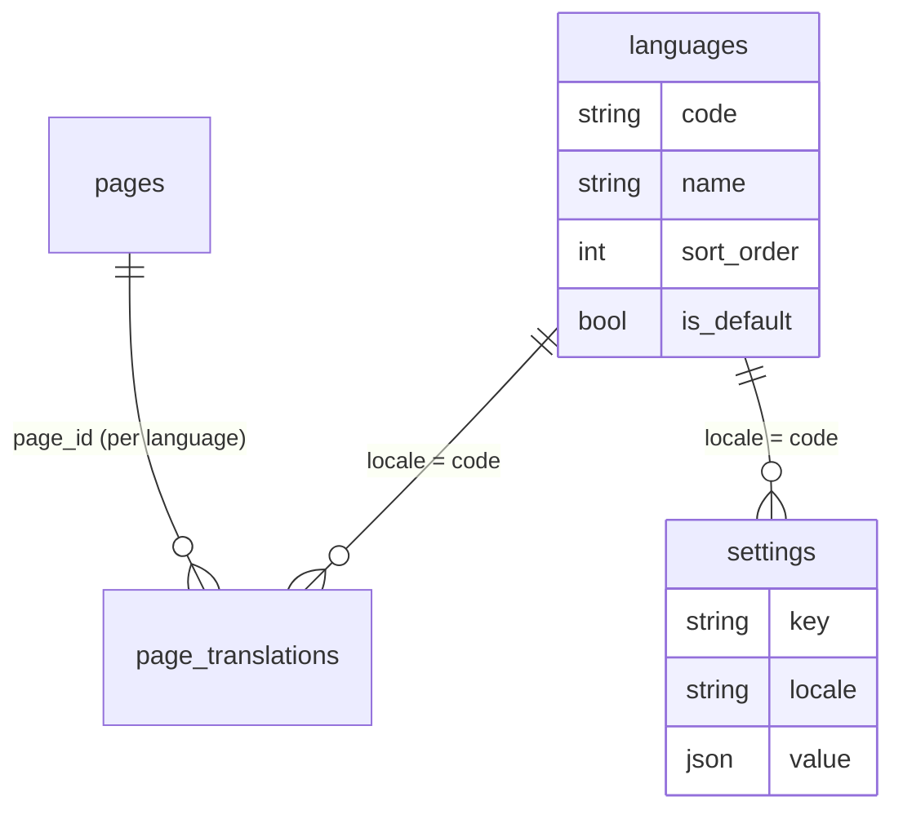

# Implementation Plan: Страницы (блоки flexible-layouts) + переводы + SEO + настройки шапки/подвала

Branch: main (без создания ветки — `git.create_branches: false`)
Created: 2026-09-12
Supersedes: прежний план «domain-db-architecture» (переписан из-за смены скоупа — каталог отложен до CRM-склада)

## Original Request

http://bronber_store.test/ тут будет Moonshine админка + povly/moonshine-flexible-layouts и там в муншайне свои поля и прочее. Поизучай по сайтам, как советуешь реализовать структуру, архитектуру в базе данных? В целом это интернет-магазин, но продукты будут отдельно от адмсинки - типо свой склад CRM, но вместе будет работать, там просто на поддомене! И без личного кабинета настройки пока

да, у нас если что есть и английския язык, два языка и также редактируется в админке
и еще у нас нет страницы, как мы будем делать страницу? должна быть возможность и там дальше делаем типо заголовок, slug, сео штуки и список блоков povly/moonshine-flexible-layouts через него, блоки делаем! а остальное интегрируется в блоки как-то! это не сложно! но есть моменты где не обязательно редакитровать блоки, и там минимальное типо заголовок поменять, а дальше уже как-то из бд получает, или с апишки и прочее
Кароче делаем только список страницы + переводы + сео теги. Также будет какие-то настройки (Шапка, подвал чтобы могли редактировать и с переводами тоже!). Все что с товарами и каптегориями пока ничего не делаем, потому что у нас будет CRM склад в будущем, а пока неизвестно как сделаем! просто сделай как блоки обычные без редактировангий!

и также с заказами, с личным кабинетом и прочее. НО их тоже не трогаем, там не будет в списке страниц, а в коде зафиксирован

## Settings

- Testing: yes (Pest, `php artisan make:test --pest`)
- Logging: verbose (DEBUG на разработке; логируем slug/ключи/ID, без PII — здесь её почти нет)
- Docs: yes → обязательный docs-чекпоинт в `/aif-implement` через `/aif-docs`

## Архитектура (итог)

### Ключевые решения

1. **Скоуп v1 — только страницы и настройки.** Товары, категории, заказы, личный кабинет, корзина — **не трогаем**: остаются фиксированными closure-роутами/кодом прототипа, в списке страниц их НЕТ. Каталог появится позже вместе с CRM-складом на поддомене (отдельное приложение + API).
2. **Страница = заголовок + slug + SEO + список блоков.** Контент страницы — поле `FlexibleLayouts` (пакет `povly/moonshine-flexible-layouts`): блоки хранятся в JSON-колонке `content` с `_type`-ключами, порядок — drag-n-drop, добавление — AJAX-пикер.
3. **Переводы — отдельными строками (locale = строка), не JSON-в-колонке.** У каждой локали свой набор блоков — состав и порядок могут отличаться; в админке переводы редактируются табами (HasMany translations) **по числу активных языков из БД**. SEO-поля (`meta_title`, `meta_description`) тоже пер-локали. Fallback на публичной части: нет перевода для текущей локали → показываем перевод дефолтного языка.
3a. **Языки редактируются в админке (добавлено по ходу, 2026-09-12).** Таблица `languages` (code unique, name, sort_order, is_default): сидируется ru (default) + en; новые языки добавляются через `LanguageResource` в MoonShine. `App\Services\Languages\LanguageService` (кэш через Cache, сброс при сохранении Language) — единый источник списка активных языков: middleware `SetLocale`, регистрация i18n-роутов, автосоздание переводов страницы, сидеры настроек, fallback локали = дефолтный язык (НЕ хардкод ru). `config('app.available_locales')` остаётся bootstrap-фолбэком до появления записей в БД. Кавеат: `route:cache` замораживает список локалей — после добавления языка нужен `php artisan optimize:clear` (задокументировать в Task 9).
4. **Два типа блоков.**
   - **Статические**: hero (заголовок+подзаголовок+картинка), text (тело — EditorJS `sckatik/moonshine-editorjs` или Textarea), gallery (Json-массив картинок, image-editor), faq (список вопрос-ответ), contacts (адрес/телефон/карта) — всё содержимое редактируется в блоке.
   - **Динамические**: например `featured-products` — в блоке редактируется ТОЛЬКО заголовок (и минимум параметров), данные рендерер берёт из источника: сейчас `App\Support\CatalogMock` (копия mock-массивов из роутов, сами роуты не трогаем), в будущем — API склада-CRM. Это паттерн «поменял заголовок, остальное само».
5. **Шапка/подвал — те же блоки, тот же механизм.** Таблица `settings` (key × locale, `value` JSON = блоки FlexibleLayouts): ключи `header`, `footer`; блоки навигации/контактов/ссылок/копирайта. Витрина читает через `SettingService::get('header')` с кэшем; если настроек нет — fallback на текущую захардкоженную вёрстку (ничего не ломается).
6. **Один рендерер блоков** `App\Support\PageBlocks\BlockRenderer`: JSON-блоки → blade-вьюхи `resources/views/components/page-blocks/{type}.blade.php` (+ `header/`, `footer/` для настроек). Статические и динамические блоки идут через один管道.
7. **Публичный роутинг — catch-all в конце `routes/web.php`.** `/{slug}` и `/en/{slug}` регистрируются ПОСЛЕДНИМИ (внутри существующего i18n-паттерна `$register`), поэтому фиксированные роуты (каталог, корзина, заказы, кабинет, контакты прототипа) не перекрываются. Страница не найдена/не опубликована → 404.
8. **SEO**: `meta_title`, `meta_description` пер-локали прокидываются в layout (`@yield('meta_title')` и т.п.); title страницы = `title` перевода.
9. **Без новых зависимостей.** Используем уже установленные: `povly/moonshine-flexible-layouts` ^1.0, `sckatik/moonshine-editorjs` ^2.0, `povly/moonshine-image-editor`, `yurizoom/moonshine-media-manager`.
10. **MoonShine — строго по скиллу `moonshine-v4`**: v4-неймспейсы, layout `app/MoonShine/Resources/{Model}/Pages/`, `#[Fillable]`-атрибуты, whitelist полей.

### Схема БД (v1)

| Таблица | Колонки |
|---|---|
| **languages** | id, code varchar(12) unique, name varchar(255), sort_order int default 0, is_default bool default false, timestamps |
| **pages** | id, slug varchar unique, is_published bool default false, sort_order int default 0, timestamps |
| **page_translations** | id, page_id FK cascadeOnDelete, locale varchar(12) index, title varchar(255), meta_title varchar(255) nullable, meta_description text nullable, content JSON nullable (блоки flexible-layouts, `_type`-ключи), timestamps, **unique(page_id, locale)** |
| **settings** | id, key varchar(100) index, locale varchar(12) index, value JSON nullable (блоки flexible-layouts), timestamps, **unique(key, locale)** |

Денормализаций и денег тут нет — контентный модуль. JSON-колонки работают и в SQLite, и в MySQL.

## Commit Plan

- **Commit 1** (после задач 1–2): `feat: pages, translations and settings schema with models`
- **Commit 2** (после задач 3–5): `feat: flexible block library and blade renderer`
- **Commit 3** (после задач 6–8): `feat: moonshine page and settings resources`
- **Commit 4** (после задач 9–10): `feat: public page rendering and header footer settings wiring`
- **Commit 5** (после задачи 11): `docs: pages and settings module documentation`

## Tasks

### Phase 1: Данные

- [x] Task 1: Миграции pages, page_translations, settings
  Три миграции по схеме выше (snake_case, `create_{table}_table`): unique-ограничения (pages.slug; page_translations (page_id, locale); settings (key, locale)), индексы locale, FK cascadeOnDelete. Проверка: `php artisan migrate` + `php artisan db:table page_translations`.
  LOGGING: n/a (миграции).
  Files: `database/migrations/*_create_pages_table.php`, `*_create_page_translations_table.php`, `*_create_settings_table.php`.

- [ ] Task 2: Модели Page, PageTranslation, Setting + SettingService + factories (depends: 1)
  `#[Fillable]`/`#[Cast]` PHP-атрибуты (конвенция проекта), `declare(strict_types=1)`. `Page`: hasMany translations, `scopePublished`, `translation(?string $locale = null): ?PageTranslation` (запрошенная локаль → fallback ru → первая). `PageTranslation`: belongsTo, cast `content: array`. `Setting`: cast `value: array`, static `get(string $key, ?string $locale = null): array` (fallback ru) — через `app/Services/Settings/SettingService` с per-request кэшем (+ опционально Cache::remember). Factories для всех. Unit/feature-тесты: fallback локали, unique-нарушения, кэш сервиса.
  LOGGING: `Log::debug('[SettingService.get] key={key} locale={locale} hit={bool}')` — только ключи/локали.
  Files: `app/Models/{Page,PageTranslation,Setting}.php`, `app/Services/Settings/SettingService.php`, `database/factories/*`, `tests/Feature/*`.

### Phase 1b: Языки (добавлено по ходу)

- [x] Task 3: Языки — миграция, Language, LanguageService + интеграция (depends: 2)
  Миграция `languages` (code unique, name, sort_order, is_default; unique code). Модель `App\Models\Language` (`#[Fillable]`, strict_types, factory, static `defaultCode()`), `App\Services\Languages\LanguageService`: `codes(): array<string>` (по sort_order, кэш Cache::rememberForever, сброс через model events saved/deleted), `defaultCode(): string` (fallback `config('app.available_locales.0')`), `clearCache()`. Интеграция: `Page::translation()` fallback 'ru' → defaultCode(); `SettingService::resolve()` 'ru' → defaultCode(); `SetLocale` валидирует по `LanguageService::codes()` (fallback на config); `routes/web.php` — i18n-цикл из `LanguageService` вместо config. Сидер `LanguageSeeder`: ru (default) + en. Тесты: codes/defaultCode, кэш-сброс при сохранении, fallback через дефолтный язык, middleware принимает новый язык.
  LOGGING: `Log::debug('[LanguageService] codes resolved, count={n} default={code}')`.
  Files: `database/migrations/*_create_languages_table.php`, `app/Models/Language.php`, `app/Services/Languages/LanguageService.php`, `app/Http/Middleware/SetLocale.php` (правка), `app/Models/Page.php` (правка fallback), `app/Services/Settings/SettingService.php` (правка fallback), `routes/web.php` (правка i18n-цикла), `database/seeders/LanguageSeeder.php`, `database/factories/LanguageFactory.php`, `tests/Feature/*`.

### Phase 2: Блоки

- [x] Task 4: Каталог блоков FlexibleLayouts + MockCatalog (depends: 2)
  `app/Support/PageBlocks/PageBlockLibrary.php`: методы `page(): FlexibleLayouts` (hero/text/gallery/faq/contacts + динамический featured-products с полями только заголовок и кол-во), `header(): FlexibleLayouts` (nav-ссылки, контакты), `footer(): FlexibleLayouts` (колонка ссылок, соцсети, копирайт). Блоки объявляются через `->block($name, $title, $fields, $limit, $category)` с иконками/категориями в пикере; внутри — Flex/Column для многоколоночных полей, EditorJS-поле для text, Json+image-editor для gallery. `App\Support\CatalogMock` — перенос (копия) mock-массивов товаров/категорий из `routes/web.php` в класс (роуты НЕ трогаем) для динамических блоков.
  LOGGING: n/a (конфигурация полей).
  Files: `app/Support/PageBlocks/PageBlockLibrary.php`, `app/Support/CatalogMock.php`.

- [x] Task 5: BlockRenderer + blade-вьюхи блоков (depends: 4)
  `app/Support/PageBlocks/BlockRenderer.php`: `render(array $blocks, string $context = 'page'): string` — каждый блок `{_type, ...поля}` → view `components.page-blocks.{context}.{type}` c данными; неизвестный тип → лог WARN + пропуск (страница не падает). Вьюхи: `resources/views/components/page-blocks/page/{hero,text,gallery,faq,contacts,featured-products}.blade.php` (featured-products берёт данные из `CatalogMock`), `.../header/{nav,contacts}.blade.php`, `.../footer/{links,socials,copyright}.blade.php`. Вёрстка — по образцу существующих block-паршлов (`resources/views/blocks/...`). Тесты рендерера: тип→view, данные передаются, неизвестный тип не падает.
  LOGGING: `Log::warning('[BlockRenderer] unknown block type={type}, skipped')`.
  Files: `app/Support/PageBlocks/BlockRenderer.php`, `resources/views/components/page-blocks/**`, `tests/Feature/*`.

### Phase 3: MoonShine-админка

- [ ] Task 6: PageResource — список страниц с переводами (depends: 3, 4)
  По скиллу `moonshine-v4` (`php artisan moonshine:resource Page --pest`, разложить в `app/MoonShine/Resources/Page/Pages/`). Index: slug, title текущей локали, is_published badge, sort_order. Form: slug (+автогенерация), is_published Switcher, sort_order, **HasMany translations** (табы по АКТИВНЫМ ЯЗЫКАМ из `LanguageService`: title, meta_title, meta_description — SEO-блок во вкладке, `FlexibleLayouts::make('Контент','content')` из `PageBlockLibrary::page()`); при создании страницы автосоздавать переводы для всех активных языков (onBeforeSave/observer). Правила валидации: slug unique + kebab, title required, locale in: активные языки. Whitelist полей, `activeActions()->except(Action::VIEW)`. Регистрация в `MoonShineServiceProvider`, меню `#[Group('content')]`. Feature-тесты: CRUD, JSON-структура блоков (`_type` сохраняется), переводы создаются под все активные языки.
  LOGGING: `Log::info('[PageResource] page_id={id} saved by moonshine_user_id={uid}')`.
  Files: `app/MoonShine/Resources/Page/**`, `app/Providers/MoonShineServiceProvider.php`, `tests/Feature/*`.

- [ ] Task 7: LanguageResource — управление языками в админке (depends: 3)
  ModelResource на Language по скиллу `moonshine-v4`: Index — code (badge), name, sort_order, is_default badge. Form: code (alpha-dash, lower, unique; залочен на редактировании — код это ключ связей), name, sort_order, is_default Switcher (снятие флага у единственного дефолтного языка — запрещаем валидацией; переключение дефолта переносит флаг и сбрасывает кэш LanguageService). Регистрация в `MoonShineServiceProvider`, меню `#[Group('settings')]`. Feature-тесты: CRUD, смена дефолта сбрасывает кэш и меняет `defaultCode()`, нельзя оставить систему без дефолтного языка.
  LOGGING: `Log::info('[LanguageResource] language code={code} saved, default_changed={bool}')`.
  Files: `app/MoonShine/Resources/Language/**`, `app/Providers/MoonShineServiceProvider.php`, `tests/Feature/*`.

- [ ] Task 8: SettingResource — шапка/подвал с переводами (depends: 3, 4)
  ModelResource на Setting: Index — key (badge), locale (badge), value-превью; фильтр по key. Form: key и locale залочены на редактировании (title-подсказки «Шапка / RU»), `FlexibleLayouts::make('Значение','value')` — конфигурация блоков по ключу (header → `PageBlockLibrary::header()`, footer → `footer()`). Сидер: header/footer × ВСЕ активные языки из `LanguageService` — при первом входе можно править. Feature-тесты: CRUD, уникальность (key, locale), блоки сохраняются.
  LOGGING: `Log::info('[SettingResource] key={key} locale={locale} saved')`.
  Files: `app/MoonShine/Resources/Setting/**`, `database/seeders/SettingsSeeder.php`, `tests/Feature/*`.

### Phase 4: Витрина (минимум)

- [ ] Task 9: Публичный рендеринг страниц + SEO (depends: 3, 5)
  `app/Http/Controllers/PageController.php`: `show(string $slug)` — published-страница по slug, перевод текущей локали (fallback дефолтный язык), 404 если нет. Рендер через BlockRenderer; meta через `view()->share`/section: `@yield('meta_title')`, `@yield('meta_description')` в layout. Роуты catch-all `/{slug}` и `/{locale}/{slug}` для всех недефолтных языков — добавить В КОНЦЕ `routes/web.php` внутри существующего i18n-паттерна (после всех фиксированных роутов — каталог/заказы/кабинет не перекрываются). Демо-сидер: 1–2 страницы (например «О компании» для всех активных языков, пара блоков) для проверки конвейера. Feature-тесты: страница рендерится, роут недефолтной локали даёт её перевод, fallback на дефолтный язык, 404 для черновика/несуществующей, фиксированные роуты не перекрыты.
  LOGGING: `Log::debug('[PageController.show] slug={slug} locale={locale} found={bool}')`.
  Files: `app/Http/Controllers/PageController.php`, `routes/web.php` (только добавление в конец), `database/seeders/DemoPageSeeder.php`, `tests/Feature/*`.

- [ ] Task 10: Шапка/подвал из настроек с fallback (depends: 5, 8)
  Layout-паршлы шапки/подвала читают `SettingService::get('header'|'footer')` → BlockRenderer(context: header/footer); если настроек нет/пусто — текущая статическая вёрстка не меняется (условие @if вокруг). Compose через view composer или в `AppServiceProvider::boot()` — чтобы данные были во всех views. Feature-тест: настройка задана → блок рендерится; не задана → статика.
  LOGGING: `Log::debug('[Layout] settings header/footer resolved, source={settings|fallback}')`.
  Files: `app/Providers/AppServiceProvider.php`, `resources/views/blocks/layout/**` (шапка/подвал), `tests/Feature/*`.

### Phase 5: Финализация

- [ ] Task 11: Docs-чекпоинт + финальные проверки (depends: all)
  Обязательный чекпоинт через `/aif-docs`: обновить `docs/admin-panel.md` (PageResource/SettingResource/LanguageResource, блоки flexible-layouts, управление языками), `docs/architecture.md` (раздел «Страницы и блоки»: схема таблиц включая languages, BlockRenderer, паттерн переводов, динамические языки + кавеат `route:cache`/`optimize:clear` после добавления языка, стратегия будущей CRM-каталога и динамических блоков). Финальный прогон: `vendor/bin/pint --dirty --format agent`, `php artisan test --compact`, `php artisan moonshine:resources`.
  LOGGING: n/a.
  Files: `docs/admin-panel.md`, `docs/architecture.md`.

## Что НЕ входит в этот план (осознанно)

- **Товары, категории, заказы, корзина, личный кабинет** — не трогаем: остаются фиксированными в коде (closure-роуты прототипа), в списке страниц их нет. Каталог/остатки появятся вместе с CRM-складом (отдельное приложение на поддомене + API) — динамические блоки (featured-products) уже готовы к подмене источника данных с `CatalogMock` на API.
- **Массовая миграция существующих статических страниц** (FAQ, контакты, о нас и т.д.) в DB-страницы — после этого плана, постранично (механизм и демо-страница будут).
- **Блог/статьи** — тот же паттерн, что и страницы; отдельной фазой позже.
- **Новые composer-зависимости** — не добавляются.
